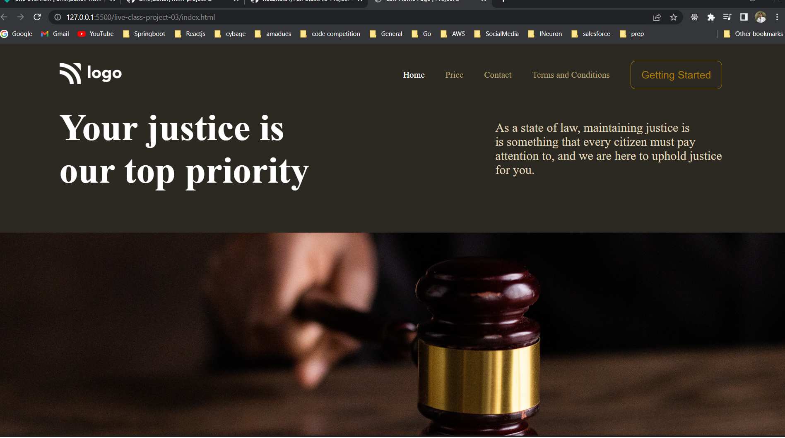

# Javascript Bootcamp

## html-css project 3

## Project 3 [Live Link](https://amirjadhav-html-project-3.netlify.app)

- Skills Gained in this project
  - Learnd to Place an image inside div and centering image without squishing or breaking image size with object-fit & object-position

---

#### Screenshot

